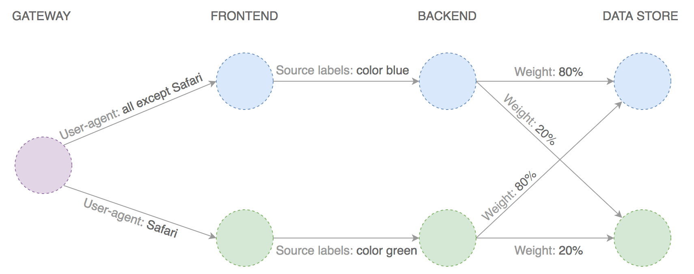

# GitOps for Istio Canary Deployments

This is a step by step guide on how to set up a GitOps workflow for Istio with Weave Flux. 
GitOps is a way to do Continuous Delivery, it works by using Git as a source of truth for declarative infrastructure 
and workloads. In practice this means using `git push` instead of `kubectl create/apply` or `helm install/upgrade`.

### Install Weave Flux with Helm

Add the Weave Flux chart repo:

```bash
helm repo add weaveworks https://weaveworks.github.io/flux
```

Install Weave Flux and its Helm Operator by specifying your fork URL 
(replace `stefanprodan` with your GitHub username): 

```bash
helm install --name flux \
--set helmOperator.create=true \
--set git.url=git@github.com:stefanprodan/gitops-istio \
--set git.chartsPath=charts \
--namespace flux \
weaveworks/flux
```

You can connect Weave Flux to Weave Cloud using a service token:

```bash
helm install --name flux \
--set token=YOUR_WEAVE_CLOUD_SERVICE_TOKEN \
--set helmOperator.create=true \
--set git.url=git@github.com:stefanprodan/gitops-istio \
--set git.chartsPath=charts \
--namespace flux \
weaveworks/flux
```

Note that Flux Helm Operator works with Kubernetes 1.9 or newer.

### Setup Git sync

At startup, Flux generates a SSH key and logs the public key. 
Find the SSH public key with:

```bash
kubectl -n flux logs deployment/flux | grep identity.pub 
```

In order to sync your cluster state with git you need to copy the public key and 
create a **deploy key** with **write access** on your GitHub repository.

Open GitHub and fork this repo, navigate to your fork, go to _Settings > Deploy keys_ click on _Add deploy key_, check 
_Allow write access_, paste the Flux public key and click _Add key_.

### Install Istio with Weave Flux

The Flux Helm operator provides an extension to Weave Flux that automates Helm Chart releases for it.
A Chart release is described through a Kubernetes custom resource named `FluxHelmRelease`.
The Flux daemon synchronizes these resources from git to the cluster,
and the Flux Helm operator makes sure Helm charts are released as specified in the resources.

Istio release definition:

```yaml
apiVersion: helm.integrations.flux.weave.works/v1alpha2
kind: FluxHelmRelease
metadata:
  name: istio
  namespace: istio-system
  labels:
    chart: istio
spec:
  chartGitPath: istio
  releaseName: istio
  values:
    global:
      nodePort: false
    ingress:
      enabled: false
    sidecarInjectorWebhook:
      enabled: true
      enableNamespacesByDefault: false
    gateways:
      enabled: true
    grafana:
      enabled: true
    prometheus:
      enabled: true
    servicegraph:
      enabled: true
    tracing:
      enabled: true
    certmanager:
      enabled: true
```

### A/B Testing initial state


Frontend:

```yaml
apiVersion: helm.integrations.flux.weave.works/v1alpha2
kind: FluxHelmRelease
metadata:
  name: frontend
  namespace: demo
spec:
  chartGitPath: podinfo-istio
  releaseName: frontend
  values:
    host: podinfo.istio.weavedx.com
    exposeHost: true

    blue:
      replicas: 2
      image: quay.io/stefanprodan/podinfo:1.0.0
      message: "Greetings from the blue frontend"
      backend: http://backend:9898/api/echo

    green:
      # disabled (all traffic goes to blue)
      replicas: 0
```

Backend:

```yaml
apiVersion: helm.integrations.flux.weave.works/v1alpha2
kind: FluxHelmRelease
metadata:
  name: backend
  namespace: demo
spec:
  chartGitPath: podinfo-istio
  releaseName: backend
  values:
    host: backend

    blue:
      replicas: 2
      image: quay.io/stefanprodan/podinfo:1.0.0
      backend: http://store:9898/api/echo

    green:
      # disabled (all traffic goes to blue)
      replicas: 0
```

Data store:

```yaml
apiVersion: helm.integrations.flux.weave.works/v1alpha2
kind: FluxHelmRelease
metadata:
  name: store
  namespace: demo
spec:
  chartGitPath: podinfo-istio
  releaseName: store
  values:
    host: store

    blue:
      replicas: 2
      image: quay.io/stefanprodan/podinfo:1.0.0
      weight: 100

    green:
      # disabled (all traffic goes to blue)
      replicas: 0
```

### A/B Testing desired state



Frontend:

```yaml
apiVersion: helm.integrations.flux.weave.works/v1alpha2
kind: FluxHelmRelease
metadata:
  name: frontend
  namespace: demo
  annotations:
    flux.weave.works/automated: "true"
    flux.weave.works/tag.blue: glob:1.0.0
    flux.weave.works/tag.green: semver:~1.0
spec:
  chartGitPath: podinfo-istio
  releaseName: frontend
  values:
    # expose the frontend deployment outside the cluster
    host: podinfo.istio.weavedx.com
    exposeHost: true

    blue:
      replicas: 2
      image: quay.io/stefanprodan/podinfo:1.0.0
      message: "Greetings from the blue frontend"
      backend: http://backend:9898/api/echo

    green:
      replicas: 2
      image: quay.io/stefanprodan/podinfo:1.0.0
      routing:
        # target Safari
        - match:
          - headers:
              user-agent:
                regex: "^(?!.*Chrome).*Safari.*"
        # target API clients by version
        - match:
          - headers:
              x-api-version:
                regex: "^(v{0,1})1\\.0\\.([1-9]).*"
      message: "Greetings from the green frontend"
      backend: http://backend:9898/api/echo
```

Backend:

```yaml
apiVersion: helm.integrations.flux.weave.works/v1alpha2
kind: FluxHelmRelease
metadata:
  name: backend
  namespace: demo
spec:
  chartGitPath: podinfo-istio
  releaseName: backend
  values:
    # expose the backend deployment inside the cluster on backend.demo
    host: backend

    blue:
      replicas: 2
      image: quay.io/stefanprodan/podinfo:1.0.0
      backend: http://store:9898/api/echo

    green:
      replicas: 2
      image: quay.io/stefanprodan/podinfo:1.0.0
      routing:
        # target green callers
        - match:
          - sourceLabels:
              color: green
      backend: http://store:9898/api/echo
```

Data store:

```yaml
apiVersion: helm.integrations.flux.weave.works/v1alpha2
kind: FluxHelmRelease
metadata:
  name: store
  namespace: demo
spec:
  chartGitPath: podinfo-istio
  releaseName: store
  values:
    # expose the store deployment inside the cluster on store.demo
    host: store

    # load balance 80/20 between blue and green
    blue:
      replicas: 2
      image: quay.io/stefanprodan/podinfo:1.0.0
      weight: 80

    green:
      replicas: 2
      image: quay.io/stefanprodan/podinfo:1.0.0
```
